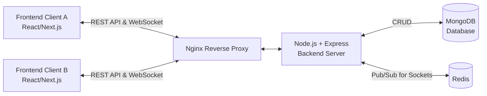

# System Design Document

## 1. High-Level Architecture Diagram

*Note: Redis is used to scale WebSockets across multiple Node.js instances.*

## 2. API List

| Method | Endpoint | Purpose |
| :--- | :--- | :--- |
| **POST** | `/api/auth/register` | Register a new user |
| **POST** | `/api/auth/login` | Authenticate user and return JWT |
| **GET** | `/api/projects` | Fetch all projects |
| **POST** | `/api/projects` | Create a new project |
| **GET** | `/api/projects/:id` | Fetch a specific project and its tasks |
| **POST** | `/api/projects/:id/tasks` | Create a new task within a project |
| **PUT** | `/api/tasks/:id` | Update a task (e.g., change status) |
| **DELETE**| `/api/tasks/:id` | Delete a task |

## 3. Database Schema (MongoDB Collections)

**Users Collection**
* `_id`: ObjectId
* `username`: String (Unique)
* `password`: String (Hashed)
* `createdAt`: Date

**Projects Collection**
* `_id`: ObjectId
* `name`: String
* `description`: String
* `createdAt`: Date

**Tasks Collection**
* `_id`: ObjectId
* `projectId`: ObjectId (Ref: Projects)
* `title`: String
* `description`: String
* `status`: String (Enum: 'Todo', 'In Progress', 'Done')
* `createdAt`: Date
* `updatedAt`: Date

## 4. Real-Time Communication Strategy

* **Technology**: WebSockets using `Socket.IO`.
* **Flow**: 
    1. Client connects to the WebSocket server upon successful login and joins a "room" specific to the `projectId` they are viewing.
    2. When User A updates a task (e.g., via REST API `PUT /api/tasks/:id`), the backend updates the database.
    3. The backend then emits a `task_updated` event to the specific `projectId` room via Socket.IO.
    4. All other clients in that room (User B, User C) receive the `task_updated` event and update their local UI state (using React Context API) instantly without refreshing.

## 5. Why this Approach was Chosen

* **MERN Stack**: Highly productive for full-stack JavaScript development. Fits the assignment requirements perfectly.
* **Socket.IO**: Provides robust real-time bidirectional event-based communication with fallbacks to long-polling if WebSockets are not supported.
* **Redis**: Included to allow future horizontal scaling of the Node.js server. If we have multiple Node instances, Redis Pub/Sub ensures a socket event emitted from Instance A reaches a user connected to Instance B.
* **Context API (Frontend)**: Chosen for state management because it's built directly into React, avoiding external dependencies for global state. For this scale of application, it efficiently provides a centralized store to merge real-time socket events with the project's task lists.

## 6. Scalability Considerations

* **Stateless Auth**: JWT is used so the backend doesn't need to store session state, allowing any Node instance to authenticate any request.
* **Horizontal Scaling (Backend)**: The Node.js app can be scaled behind a Load Balancer (Nginx). Redis Adapter for Socket.IO ensures real-time events propagate across all instances.
* **Database Scaling**: MongoDB can be scaled horizontally via Sharding and vertically by upgrading the VM instances. Indexes will be added on `projectId` in the Tasks collection to optimize query performance.
